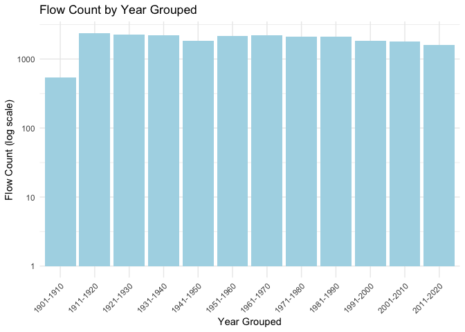
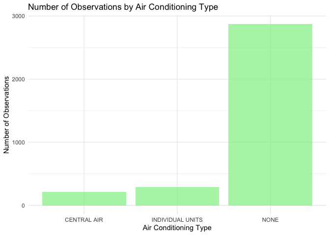
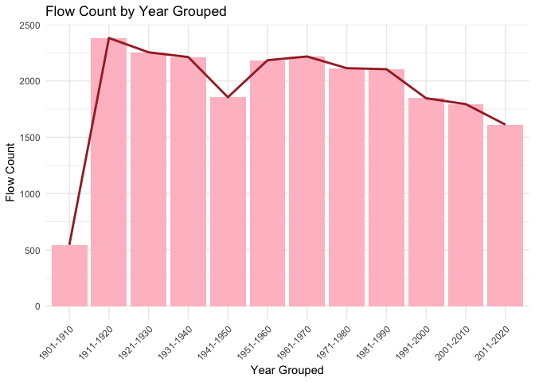
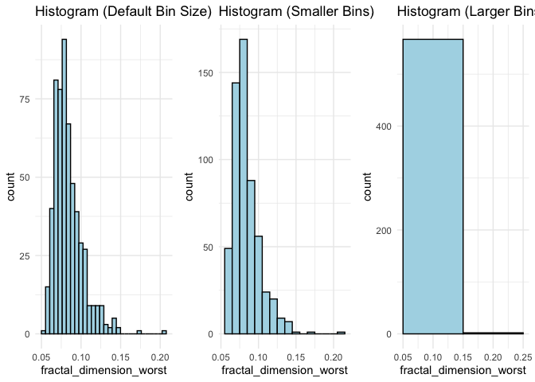
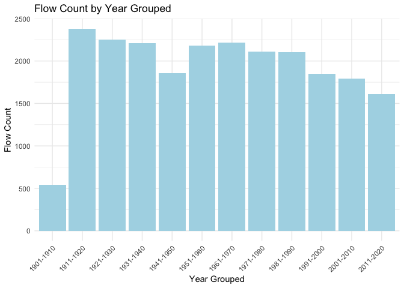
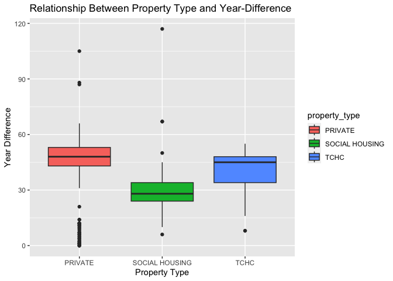

Milestone 2
================
Wakeel Kasali
2023-10-24

Mini Data Analysis Milestone 2 To complete this milestone, you can
either edit this .rmd file directly. Fill in the sections that are
commented out with <!--- start your work here--->. When you are done,
make sure to knit to an .md file by changing the output in the YAML
header to github_document, before submitting a tagged release on canvas.

Welcome to the rest of your mini data analysis project! In Milestone 1,
you explored your data. and came up with research questions. This time,
we will finish up our mini data analysis and obtain results for your
data by:

Making summary tables and graphs Manipulating special data types in R:
factors and/or dates and times. Fitting a model object to your data, and
extract a result. Reading and writing data as separate files. We will
also explore more in depth the concept of tidy data.

NOTE: The main purpose of the mini data analysis is to integrate what
you learn in class in an analysis. Although each milestone provides a
framework for you to conduct your analysis, it’s possible that you might
find the instructions too rigid for your data set. If this is the case,
you may deviate from the instructions – just make sure you’re
demonstrating a wide range of tools and techniques taught in this class.

Instructions To complete this milestone, edit this very .Rmd file
directly. Fill in the sections that are tagged with
<!--- start your work here--->.

To submit this milestone, make sure to knit this .Rmd file to an .md
file by changing the YAML output settings from output: html_document to
output: github_document. Commit and push all of your work to your
mini-analysis GitHub repository, and tag a release on GitHub. Then,
submit a link to your tagged release on canvas.

Points: This milestone is worth 50 points: 45 for your analysis, and 5
for overall reproducibility, cleanliness, and coherence of the Github
submission.

Research Questions: In Milestone 1, you chose two research questions to
focus on. Wherever realistic, your work in this milestone should relate
to these research questions whenever we ask for justification behind
your work. In the case that some tasks in this milestone don’t align
well with one of your research questions, feel free to discuss your
results in the context of a different research question.

Learning Objectives By the end of this milestone, you should:

Understand what tidy data is, and how to create it using tidyr. Generate
a reproducible and clear report using R Markdown. Manipulating special
data types in R: factors and/or dates and times. Fitting a model object
to your data, and extract a result. Reading and writing data as separate
files. Setup Begin by loading your data and the tidyverse package below:

``` r
library(datateachr) # <- might contain the data you picked!
library(tidyverse)
```

    ## ── Attaching core tidyverse packages ──────────────────────── tidyverse 2.0.0 ──
    ## ✔ dplyr     1.1.3     ✔ readr     2.1.4
    ## ✔ forcats   1.0.0     ✔ stringr   1.5.0
    ## ✔ ggplot2   3.4.4     ✔ tibble    3.2.1
    ## ✔ lubridate 1.9.2     ✔ tidyr     1.3.0
    ## ✔ purrr     1.0.2     
    ## ── Conflicts ────────────────────────────────────────── tidyverse_conflicts() ──
    ## ✖ dplyr::filter() masks stats::filter()
    ## ✖ dplyr::lag()    masks stats::lag()
    ## ℹ Use the conflicted package (<http://conflicted.r-lib.org/>) to force all conflicts to become errors

``` r
library(gridExtra)
```

    ## 
    ## Attaching package: 'gridExtra'
    ## 
    ## The following object is masked from 'package:dplyr':
    ## 
    ##     combine

``` r
library(broom)
library(here)
```

    ## here() starts at /Users/wakeelkasali/Documents/projects/mda-WakeelAdekunleKasali

Task 1: Process and summarize your data From milestone 1, you should
have an idea of the basic structure of your dataset (e.g. number of rows
and columns, class types, etc.). Here, we will start investigating your
data more in-depth using various data manipulation functions.

1.1 (1 point) First, write out the 4 research questions you defined in
milestone 1 were. This will guide your work through milestone 2:

1.  How does the distribution of the “flow” variable change in every 10
    years in the “flow_sample” dataset? This will break the year date to
    every decade(ten years).This might involve using group_by(), select,
    count(),summary() and pipe functions, including ggplot()

2.  What is the relationship between year of construction and year of
    registration in the apt_building dataset ? This will require
    plotting with ggplot. NB: I am changing this to - How is the
    difference in year of registration for different property-type?.
    This might involve filter(), group_by(), summarise(), and
    geom-boxplot

3.  What is the form of relationship - positive or negative - between
    the fractal_dimension_mean and compactness_mean using
    “cancer_sample”? This might attract coding for fitting regression
    line.

4.  For the purpose of urban planning and using vancouver_tree dataset,
    what is the distribution pattern of trees in KENSINGTON-CEDAR
    COTTAGE neighbourhood having a street_side_name that are even. This
    would take filter(), select(), and some other dyplyr functions
    including ggplot.

Here, we will investigate your data using various data manipulation and
graphing functions.

1.2 (8 points) Now, for each of your four research questions, choose one
task from options 1-4 (summarizing), and one other task from 4-8
(graphing). You should have 2 tasks done for each research question (8
total). Make sure it makes sense to do them! (e.g. don’t use a numerical
variables for a task that needs a categorical variable.). Comment on why
each task helps (or doesn’t!) answer the corresponding research
question.

Ensure that the output of each operation is printed!

Also make sure that you’re using dplyr and ggplot2 rather than base R.
Outside of this project, you may find that you prefer using base R
functions for certain tasks, and that’s just fine! But part of this
project is for you to practice the tools we learned in class, which is
dplyr and ggplot2.

Summarizing:

Compute the range, mean, and two other summary statistics of one
numerical variable across the groups of one categorical variable from
your data.

``` r
# I filter out rows with NA in flow_sample
flow_sample <- flow_sample %>%
  filter(!is.na(flow))

# Calculating four statistics for "flow" across groups defined by "extreme_type"
summary_stats <- flow_sample %>%
  group_by(extreme_type) %>%
  summarize(
    range = ifelse(n() > 0, max(flow) - min(flow), NA),
    mean = mean(flow),
    median = median(flow),
    sd = sd(flow)
  )

# Print the summary statistics
print(summary_stats)
```

    ## # A tibble: 2 × 5
    ##   extreme_type  range   mean median     sd
    ##   <chr>         <dbl>  <dbl>  <dbl>  <dbl>
    ## 1 maximum      359    212.   204    61.7  
    ## 2 minimum        4.82   6.27   6.15  0.965

\#Comment: The mean and median help us understand the centrality, while
range and standard deviation help us understand the spread of the of the
categories for “extreme_type” variable.

Compute the number of observations for at least one of your categorical
variables. Do not use the function table()!

``` r
head(apt_buildings)
```

    ## # A tibble: 6 × 37
    ##      id air_conditioning amenities balconies barrier_free_accessi…¹ bike_parking
    ##   <dbl> <chr>            <chr>     <chr>     <chr>                  <chr>       
    ## 1 10359 NONE             Outdoor … YES       YES                    0 indoor pa…
    ## 2 10360 NONE             Outdoor … YES       NO                     0 indoor pa…
    ## 3 10361 NONE             <NA>      YES       NO                     Not Availab…
    ## 4 10362 NONE             <NA>      YES       YES                    Not Availab…
    ## 5 10363 NONE             <NA>      NO        NO                     12 indoor p…
    ## 6 10364 NONE             <NA>      NO        NO                     Not Availab…
    ## # ℹ abbreviated name: ¹​barrier_free_accessibilty_entr
    ## # ℹ 31 more variables: exterior_fire_escape <chr>, fire_alarm <chr>,
    ## #   garbage_chutes <chr>, heating_type <chr>, intercom <chr>,
    ## #   laundry_room <chr>, locker_or_storage_room <chr>, no_of_elevators <dbl>,
    ## #   parking_type <chr>, pets_allowed <chr>, prop_management_company_name <chr>,
    ## #   property_type <chr>, rsn <dbl>, separate_gas_meters <chr>,
    ## #   separate_hydro_meters <chr>, separate_water_meters <chr>, …

``` r
#Using apt_buildings dataset
apt_buildings_filtered <- apt_buildings %>%
  filter(!is.na(air_conditioning))

num_observations <- apt_buildings_filtered %>%
  group_by(air_conditioning) %>%
  summarize(num_observations = n())

# Print the result
print(num_observations)
```

    ## # A tibble: 3 × 2
    ##   air_conditioning num_observations
    ##   <chr>                       <int>
    ## 1 CENTRAL AIR                   211
    ## 2 INDIVIDUAL UNITS              289
    ## 3 NONE                         2870

``` r
write_csv(num_observations, here("Output", "num_observations_task1.2.csv"))
```

\#Comment: This task helps us to visualize the number of buildings wth
no airconditioning and number of buildings using different
air_conditioning

Create a categorical variable with 3 or more groups from an existing
numerical variable. You can use this new variable in the other tasks! An
example: age in years into “child, teen, adult, senior”.

``` r
head(cancer_sample)
```

    ## # A tibble: 6 × 32
    ##         ID diagnosis radius_mean texture_mean perimeter_mean area_mean
    ##      <dbl> <chr>           <dbl>        <dbl>          <dbl>     <dbl>
    ## 1   842302 M                18.0         10.4          123.      1001 
    ## 2   842517 M                20.6         17.8          133.      1326 
    ## 3 84300903 M                19.7         21.2          130       1203 
    ## 4 84348301 M                11.4         20.4           77.6      386.
    ## 5 84358402 M                20.3         14.3          135.      1297 
    ## 6   843786 M                12.4         15.7           82.6      477.
    ## # ℹ 26 more variables: smoothness_mean <dbl>, compactness_mean <dbl>,
    ## #   concavity_mean <dbl>, concave_points_mean <dbl>, symmetry_mean <dbl>,
    ## #   fractal_dimension_mean <dbl>, radius_se <dbl>, texture_se <dbl>,
    ## #   perimeter_se <dbl>, area_se <dbl>, smoothness_se <dbl>,
    ## #   compactness_se <dbl>, concavity_se <dbl>, concave_points_se <dbl>,
    ## #   symmetry_se <dbl>, fractal_dimension_se <dbl>, radius_worst <dbl>,
    ## #   texture_worst <dbl>, perimeter_worst <dbl>, area_worst <dbl>, …

``` r
#Using cancer_sample dataset

cancer_sample_3 <- cancer_sample %>%
  mutate(fractal_dimension_worst_levels = cut(fractal_dimension_worst,
                                                breaks = c(0.05, 0.1, 0.15, 0.2, 0.21),
                                                labels = c("Very Low", "Low", "Moderate", "High"),
                                                right = FALSE)) %>%
  select(ID, diagnosis, fractal_dimension_worst, fractal_dimension_worst_levels, everything())

# View the updated dataset
head(cancer_sample_3)
```

    ## # A tibble: 6 × 33
    ##         ID diagnosis fractal_dimension_worst fractal_dimension_wor…¹ radius_mean
    ##      <dbl> <chr>                       <dbl> <fct>                         <dbl>
    ## 1   842302 M                          0.119  Low                            18.0
    ## 2   842517 M                          0.0890 Very Low                       20.6
    ## 3 84300903 M                          0.0876 Very Low                       19.7
    ## 4 84348301 M                          0.173  Moderate                       11.4
    ## 5 84358402 M                          0.0768 Very Low                       20.3
    ## 6   843786 M                          0.124  Low                            12.4
    ## # ℹ abbreviated name: ¹​fractal_dimension_worst_levels
    ## # ℹ 28 more variables: texture_mean <dbl>, perimeter_mean <dbl>,
    ## #   area_mean <dbl>, smoothness_mean <dbl>, compactness_mean <dbl>,
    ## #   concavity_mean <dbl>, concave_points_mean <dbl>, symmetry_mean <dbl>,
    ## #   fractal_dimension_mean <dbl>, radius_se <dbl>, texture_se <dbl>,
    ## #   perimeter_se <dbl>, area_se <dbl>, smoothness_se <dbl>,
    ## #   compactness_se <dbl>, concavity_se <dbl>, concave_points_se <dbl>, …

\#comment: It helps us understand different levels for complexity of
tumor boundaries indicated by “Fractal dimension worst” and their
corresponding counts.

Compute the proportion and counts in each category of one categorical
variable across the groups of another categorical variable from your
data. Do not use the function table()!

``` r
head(vancouver_trees)
```

    ## # A tibble: 6 × 20
    ##   tree_id civic_number std_street genus_name species_name cultivar_name  
    ##     <dbl>        <dbl> <chr>      <chr>      <chr>        <chr>          
    ## 1  149556          494 W 58TH AV  ULMUS      AMERICANA    BRANDON        
    ## 2  149563          450 W 58TH AV  ZELKOVA    SERRATA      <NA>           
    ## 3  149579         4994 WINDSOR ST STYRAX     JAPONICA     <NA>           
    ## 4  149590          858 E 39TH AV  FRAXINUS   AMERICANA    AUTUMN APPLAUSE
    ## 5  149604         5032 WINDSOR ST ACER       CAMPESTRE    <NA>           
    ## 6  149616          585 W 61ST AV  PYRUS      CALLERYANA   CHANTICLEER    
    ## # ℹ 14 more variables: common_name <chr>, assigned <chr>, root_barrier <chr>,
    ## #   plant_area <chr>, on_street_block <dbl>, on_street <chr>,
    ## #   neighbourhood_name <chr>, street_side_name <chr>, height_range_id <dbl>,
    ## #   diameter <dbl>, curb <chr>, date_planted <date>, longitude <dbl>,
    ## #   latitude <dbl>

``` r
#Using vancouver_trees dataset
proportion_df <- vancouver_trees %>%
  group_by(curb, root_barrier) %>%
  summarise(count = n(), .groups = "drop_last") %>%
  group_by(curb) %>%
  mutate(proportion = count / sum(count), .groups = "drop_last")

proportion_df
```

    ## # A tibble: 4 × 5
    ## # Groups:   curb [2]
    ##   curb  root_barrier  count proportion .groups  
    ##   <chr> <chr>         <int>      <dbl> <chr>    
    ## 1 N     N             12080     0.943  drop_last
    ## 2 N     Y               724     0.0565 drop_last
    ## 3 Y     N            125375     0.937  drop_last
    ## 4 Y     Y              8432     0.0630 drop_last

\#comment: The output makes us know more about the distribution of root
barriers based on whether they are found in curbed street or not

Graphing:

Create a graph of your choosing, make one of the axes logarithmic, and
format the axes labels so that they are “pretty” or easier to read.

``` r
library(dplyr)
library(ggplot2)

#Plotting distribution of "flow" variable in the "flow_sample" dataset
filtered_flow_sample <- flow_sample %>%
  filter(station_id == "05BB001" & extreme_type == "maximum")

# Group data by year
grouped_flow <- filtered_flow_sample %>%
  group_by(year)

flow_year_grouped <- grouped_flow %>%
 mutate(grouped_year = paste0(floor((year - 1) / 10) * 10 + 1, "-", floor((year - 1) / 10) * 10 + 10)) %>%
  group_by(grouped_year) %>%
  summarise(flow_count = sum(flow, na.rm = TRUE))

flow_year_grouped
```

    ## # A tibble: 12 × 2
    ##    grouped_year flow_count
    ##    <chr>             <dbl>
    ##  1 1901-1910           544
    ##  2 1911-1920          2381
    ##  3 1921-1930          2254
    ##  4 1931-1940          2212
    ##  5 1941-1950          1855
    ##  6 1951-1960          2184
    ##  7 1961-1970          2217
    ##  8 1971-1980          2113
    ##  9 1981-1990          2104
    ## 10 1991-2000          1846
    ## 11 2001-2010          1794
    ## 12 2011-2020          1612

``` r
ggplot(flow_year_grouped, aes(x = grouped_year, y = flow_count)) +
  geom_bar(stat = "identity", fill = "lightblue") +
  labs(x = "Year Grouped", y = "Flow Count (log scale)", title = "Flow Count by Year Grouped") +
  theme_minimal() +
  theme(axis.text.x = element_text(angle = 45, hjust = 1)) +
  scale_x_discrete(labels = function(x) gsub(" ", "\n", x)) +
  scale_y_log10()
```

<!-- -->

\#comment: The chart enables us to visualize how flow behaves in every
ten years. The year range 1911 - 1920 had the \#highest flow count.

Make a graph where it makes sense to customize the alpha transparency.
Using variables and/or tables you made in one of the “Summarizing”
tasks:

``` r
head(num_observations)
```

    ## # A tibble: 3 × 2
    ##   air_conditioning num_observations
    ##   <chr>                       <int>
    ## 1 CENTRAL AIR                   211
    ## 2 INDIVIDUAL UNITS              289
    ## 3 NONE                         2870

``` r
# Create a bar plot with custom alpha transparency
ggplot(num_observations, aes(x = air_conditioning, y = num_observations)) +
  geom_bar(stat = "identity", fill = "lightgreen", alpha = 0.7) +
  labs(x = "Air Conditioning Type", y = "Number of Observations", title = "Number of Observations by Air Conditioning Type") +
  theme_minimal()
```

<!-- -->
\#Comment: The barchat of the airconditioning properties with their
corresponding observations.

Create a graph that has at least two geom layers.

``` r
ggplot(flow_year_grouped, aes(x = grouped_year, y = flow_count)) +
  geom_bar(stat = "identity", fill = "pink") +
  geom_line(aes(group = 1), color = "brown", size = 1) +  # Add a red line plot
  labs(x = "Year Grouped", y = "Flow Count", title = "Flow Count by Year Grouped") +
  theme_minimal() +
  theme(axis.text.x = element_text(angle = 45, hjust = 1)) +
  scale_x_discrete(labels = function(x) gsub(" ", "\n", x))
```

    ## Warning: Using `size` aesthetic for lines was deprecated in ggplot2 3.4.0.
    ## ℹ Please use `linewidth` instead.
    ## This warning is displayed once every 8 hours.
    ## Call `lifecycle::last_lifecycle_warnings()` to see where this warning was
    ## generated.

<!-- --> \#The
two geom layers in this graph are bar and line.

Create 3 histograms, with each histogram having different sized bins.
Pick the “best” one and explain why it is the best. Make sure it’s clear
what research question you are doing each operation for!

``` r
# Create a histogram with default bin size
default_bin_histogram <- cancer_sample %>%
  ggplot(aes(x = fractal_dimension_worst)) +
  geom_histogram(fill = "lightblue", color = "black") +
  labs(title = "Histogram (Default Bin Size)") +
  theme_minimal()

# Create a histogram with default bin size
smaller_bin_histogram <- cancer_sample %>%
  ggplot(aes(x = fractal_dimension_worst)) +
  geom_histogram(binwidth = 0.01, fill = "lightblue", color = "black") +
  labs(title = "Histogram (Smaller Bins)") +
  theme_minimal()

# Create a histogram with larger bins
larger_bin_histogram <- cancer_sample %>%
  ggplot(aes(x = fractal_dimension_worst)) +
  geom_histogram(binwidth = 0.1, fill = "lightblue", color = "black") +
  labs(title = "Histogram (Larger Bins)") +
  theme_minimal()

# Arrange the plots side by side
grid.arrange(default_bin_histogram, smaller_bin_histogram, larger_bin_histogram, ncol = 3)
```

    ## `stat_bin()` using `bins = 30`. Pick better value with `binwidth`.

<!-- -->
\#comment: The histogram with smaller bin is better. Because it is very
clear to read.

1.3 (2 points) Based on the operations that you’ve completed, how much
closer are you to answering your research questions? Think about what
aspects of your research questions remain unclear. Can your research
questions be refined, now that you’ve investigated your data a bit more?
Which research questions are yielding interesting results?

\#Many of the operations are not related to my research questions, yet
they do more analysis on the dataset \# which helps in improving
understanding about the dataset. Consequently, my research questions
seem more refinable. So far these two research questions yield
interesting results: \#1. How does the distribution of the “flow”
variable change in every 10 years in the “flow_sample” dataset? This
will break the year date to every decade(ten years).This might involve
using group_by(), select, count(),summary() and pipe functions,
including ggplot()

\#2 How is the difference in year of registration for different
property-type using apt_building dataset ? This might involve filter(),
group_by(), summarise(), and geom-boxplot

Task 2: Tidy your data In this task, we will do several exercises to
reshape our data. The goal here is to understand how to do this
reshaping with the tidyr package.

A reminder of the definition of tidy data:

Each row is an observation Each column is a variable Each cell is a
value

2.1 (2 points) Based on the definition above, can you identify if your
data is tidy or untidy? Go through all your columns, or if you have \>8
variables, just pick 8, and explain whether the data is untidy or tidy.
\#The dataset “cancer_sample” considering the variables “diagnosis” ,
“radius_mean” ,“texture_mean” , “perimeter_mean” , “area_mean” ,
“smoothness_mean” , “compactness_mean” , and “concavity_mean” is tidy by
ensuring each row represents unique observations, each column represents
a distinct variable, and each cell contains a particular value

2.2 (4 points) Now, if your data is tidy, untidy it! Then, tidy it back
to it’s original state. If your data is untidy, then tidy it! Then,
untidy it back to it’s original state.

Be sure to explain your reasoning for this task. Show us the “before”
and “after”. \#BEFORE

``` r
head(flow_sample)
```

    ## # A tibble: 6 × 7
    ##   station_id  year extreme_type month   day  flow sym  
    ##   <chr>      <dbl> <chr>        <dbl> <dbl> <dbl> <chr>
    ## 1 05BB001     1909 maximum          7     7   314 <NA> 
    ## 2 05BB001     1910 maximum          6    12   230 <NA> 
    ## 3 05BB001     1911 maximum          6    14   264 <NA> 
    ## 4 05BB001     1912 maximum          8    25   174 <NA> 
    ## 5 05BB001     1913 maximum          6    11   232 <NA> 
    ## 6 05BB001     1914 maximum          6    18   214 <NA>

``` r
#Untidying the dataset flow_sample
untidy_flow_sample <- flow_sample %>%
  unite(year_month, year, month, sep = "_", remove = TRUE)

# Print the untidy dataset
head(untidy_flow_sample)
```

    ## # A tibble: 6 × 6
    ##   station_id year_month extreme_type   day  flow sym  
    ##   <chr>      <chr>      <chr>        <dbl> <dbl> <chr>
    ## 1 05BB001    1909_7     maximum          7   314 <NA> 
    ## 2 05BB001    1910_6     maximum         12   230 <NA> 
    ## 3 05BB001    1911_6     maximum         14   264 <NA> 
    ## 4 05BB001    1912_8     maximum         25   174 <NA> 
    ## 5 05BB001    1913_6     maximum         11   232 <NA> 
    ## 6 05BB001    1914_6     maximum         18   214 <NA>

\#tidying it back to its original state. \#AFTER

``` r
head(untidy_flow_sample)
```

    ## # A tibble: 6 × 6
    ##   station_id year_month extreme_type   day  flow sym  
    ##   <chr>      <chr>      <chr>        <dbl> <dbl> <chr>
    ## 1 05BB001    1909_7     maximum          7   314 <NA> 
    ## 2 05BB001    1910_6     maximum         12   230 <NA> 
    ## 3 05BB001    1911_6     maximum         14   264 <NA> 
    ## 4 05BB001    1912_8     maximum         25   174 <NA> 
    ## 5 05BB001    1913_6     maximum         11   232 <NA> 
    ## 6 05BB001    1914_6     maximum         18   214 <NA>

``` r
tidy_data <- untidy_flow_sample %>%
  separate(year_month, into = c("year", "month"), sep = "_", convert = TRUE) %>%
  select(station_id, year, extreme_type, month, day, flow, sym)

# Print the original tidy dataset
head(tidy_data)
```

    ## # A tibble: 6 × 7
    ##   station_id  year extreme_type month   day  flow sym  
    ##   <chr>      <int> <chr>        <int> <dbl> <dbl> <chr>
    ## 1 05BB001     1909 maximum          7     7   314 <NA> 
    ## 2 05BB001     1910 maximum          6    12   230 <NA> 
    ## 3 05BB001     1911 maximum          6    14   264 <NA> 
    ## 4 05BB001     1912 maximum          8    25   174 <NA> 
    ## 5 05BB001     1913 maximum          6    11   232 <NA> 
    ## 6 05BB001     1914 maximum          6    18   214 <NA>

\#I did tidy it to its original state because that is the format i need
it for my research question.

2.3 (4 points) Now, you should be more familiar with your data, and also
have made progress in answering your research questions. Based on your
interest, and your analyses, pick 2 of the 4 research questions to
continue your analysis in the remaining tasks:

\#1. How does the distribution of the “flow” variable change in every 10
years in the “flow_sample” dataset? This will break the year date to
every decade(ten years).This might involve using group_by(), select,
count(),summarize() and pipe functions, including ggplot()

\#2. How is the difference in year of registration for different
property- type? for the “apt_buildings dataset”. This might involve
filter(), group_by(), summarise(), and geom-boxplot.

Explain your decision for choosing the above two research questions.
\#Decision 1: It makes us identify the long term trends in term of
consistent \#pattern or shift in the datasets that prompt decision
making for findings by \#stakeholders.

\#Decision 2: We get to understand market dynamics better as we
determine if \#certain property type tend to register earlier or later
than other ones

Now, try to choose a version of your data that you think will be
appropriate to answer these 2 questions. Use between 4 and 8 functions
that we’ve covered so far (i.e. by filtering, cleaning, tidy’ing,
dropping irrelevant columns, etc.). (If it makes more sense, then you
can make/pick two versions of your data, one for each research
question.)

\#1. How does the distribution of the “flow” variable change in every 10
years in the “flow_sample” dataset? This will break the year date to
every decade(ten years).This might involve using group_by(), select,
count(),summarize() and pipe functions, including ggplot()

``` r
#Task - 1 (summarizing).
head(grouped_flow)
```

    ## # A tibble: 6 × 7
    ## # Groups:   year [6]
    ##   station_id  year extreme_type month   day  flow sym  
    ##   <chr>      <dbl> <chr>        <dbl> <dbl> <dbl> <chr>
    ## 1 05BB001     1909 maximum          7     7   314 <NA> 
    ## 2 05BB001     1910 maximum          6    12   230 <NA> 
    ## 3 05BB001     1911 maximum          6    14   264 <NA> 
    ## 4 05BB001     1912 maximum          8    25   174 <NA> 
    ## 5 05BB001     1913 maximum          6    11   232 <NA> 
    ## 6 05BB001     1914 maximum          6    18   214 <NA>

``` r
flow_year_grouped <- grouped_flow %>%
 mutate(grouped_year = paste0(floor((year - 1) / 10) * 10 + 1, "-", floor((year - 1) / 10) * 10 + 10)) %>%
  group_by(grouped_year) %>%
  summarise(flow_count = sum(flow, na.rm = TRUE))

flow_year_grouped
```

    ## # A tibble: 12 × 2
    ##    grouped_year flow_count
    ##    <chr>             <dbl>
    ##  1 1901-1910           544
    ##  2 1911-1920          2381
    ##  3 1921-1930          2254
    ##  4 1931-1940          2212
    ##  5 1941-1950          1855
    ##  6 1951-1960          2184
    ##  7 1961-1970          2217
    ##  8 1971-1980          2113
    ##  9 1981-1990          2104
    ## 10 1991-2000          1846
    ## 11 2001-2010          1794
    ## 12 2011-2020          1612

``` r
#Task -2 (graphing)
ggplot(flow_year_grouped, aes(x = grouped_year, y = flow_count)) +
  geom_bar(stat = "identity", fill = "lightblue") +
  labs(x = "Year Grouped", y = "Flow Count", title = "Flow Count by Year Grouped") +
  theme_minimal() +
  theme(axis.text.x = element_text(angle = 45, hjust = 1)) +
  scale_x_discrete(labels = function(x) gsub(" ", "\n", x))  # To make x-axis labels become more readable
```

<!-- -->
\#comment: The chart enables us to visualize how flow behaves in every
ten years. \#The year range 1911 - 1920 had the highest flow count.

\#2. How is the difference in year of registration for different
property- type? for the “apt_buildings dataset”. This might involve
filter(), group_by(), summarise(), and geom-boxplot.

``` r
apt_buildings_new <- apt_buildings %>%
  mutate(year_difference = year_registered - year_built ) %>%
  select(id, year_built, year_registered, year_difference, everything())
#variable was defined in milestone 1.

apt_buildings_new %>%
  filter(property_type %in% c("PRIVATE", "TCHC", "SOCIAL HOUSING")) %>%
  na.omit() %>%
  ggplot(aes(x = property_type, y = year_difference, fill = property_type)) +
  geom_boxplot() +
  labs(x = "Property Type", y = "Year Difference") +
  ggtitle("Relationship Between Property Type and Year-Difference") 
```

<!-- -->

``` r
#Task 2 (Summarizing)
filtered_data <- apt_buildings_new %>%
  filter(property_type %in% c("PRIVATE", "TCHC", "SOCIAL HOUSING")) %>%
  na.omit()

# using a single pipeline i calculate statistics 
summary_stats <- filtered_data %>%
  group_by(property_type) %>%
  summarize(
    median = median(year_difference),
    range = max(year_difference) - min(year_difference)
  )

# Print the summary statistics
print(summary_stats)
```

    ## # A tibble: 3 × 3
    ##   property_type  median range
    ##   <chr>           <dbl> <dbl>
    ## 1 PRIVATE            48   105
    ## 2 SOCIAL HOUSING     28   111
    ## 3 TCHC               45    47

\#It takes much years of 48 (median) for private property-type to
register house \#even though the spread(range) - 105 is high. \#But
social housing takes 25 years to register although the variation/spread
is \#the highest.

Task 3: Modelling 3.0 (no points) Pick a research question from 1.2, and
pick a variable of interest (we’ll call it “Y”) that’s relevant to the
research question. Indicate these.

Research Question: What is the form of relationship - positive or
negative - between the fractal_dimension_mean and compactness_mean using
“cancer_sample”? This might attract coding for fitting regression line.

Variable of interest: fractal_dimension_mean

3.1 (3 points) Fit a model or run a hypothesis test that provides
insight on this variable with respect to the research question. Store
the model object as a variable, and print its output to screen. We’ll
omit having to justify your choice, because we don’t expect you to know
about model specifics in STAT 545.

You could fit a model that makes predictions on Y using another
variable, by using the lm() function. You could test whether the mean of
Y equals 0 using t.test(), or maybe the mean across two groups are
different using t.test(), or maybe the mean across multiple groups are
different using anova() (you may have to pivot your data for the latter
two). You could use lm() to test for significance of regression
coefficients.

``` r
regn <- cancer_sample %>%
  lm(fractal_dimension_mean ~ compactness_mean,.)

fractal <- tidy(regn)  %>%
  mutate_if(is.numeric, round, 3)
print(fractal)
```

    ## # A tibble: 2 × 5
    ##   term             estimate std.error statistic p.value
    ##   <chr>               <dbl>     <dbl>     <dbl>   <dbl>
    ## 1 (Intercept)         0.055     0.001     101.        0
    ## 2 compactness_mean    0.076     0.005      16.3       0

\#With p-value \< 0.05 means the regression coefficient is significant

``` r
# Calculating the t-test on "fractal_dimension_mean"
t_test_result <- t.test(cancer_sample$fractal_dimension_mean, mu = 0)

# Print the t-test result
print(t_test_result) 
```

    ## 
    ##  One Sample t-test
    ## 
    ## data:  cancer_sample$fractal_dimension_mean
    ## t = 212.16, df = 568, p-value < 2.2e-16
    ## alternative hypothesis: true mean is not equal to 0
    ## 95 percent confidence interval:
    ##  0.06221625 0.06337897
    ## sample estimates:
    ##  mean of x 
    ## 0.06279761

\#With p-value \< 0.05 means the mean of Y (fractal_dimension_mean) is
not equal 0

Note: It’s OK if you don’t know how these models/tests work. Here are
some examples of things you can do here, but the sky’s the limit.

3.2 (3 points) Produce something relevant from your fitted model: either
predictions on Y, or a single value like a regression coefficient or a
p-value. Be sure to indicate in writing what you chose to produce.

``` r
#printing estimate for intercept and regression coefficient
print(fractal$estimate)
```

    ## [1] 0.055 0.076

# A change of 1 compactness_mean in the cancer tumor is associated with an

# increase of 0.076 in its fractal_mean_worst

Your code should either output a tibble (in which case you should
indicate the column that contains the thing you’re looking for), or the
thing you’re looking for itself.

``` r
#Applying broom::augment()
regn_tibble <- augment(regn)
print(regn_tibble$.resid) #printing residuals
```

    ##   [1]  2.817081e-03 -4.185071e-03 -7.006886e-03  2.107091e-02 -6.118607e-03
    ##   [6]  8.369733e-03 -5.729749e-03  7.165435e-03  4.376224e-03  9.409207e-03
    ##  [11] -2.981863e-03 -3.856511e-03  4.510597e-03 -9.104625e-03  4.577705e-03
    ##  [16]  3.803347e-03 -1.133205e-03  3.365984e-03 -8.723581e-03 -3.395364e-03
    ##  [21]  3.599770e-03  9.231917e-03 -7.280955e-04 -9.855789e-03 -2.623618e-03
    ##  [26]  2.016195e-03  2.099510e-04 -5.978351e-03 -2.337592e-03 -2.166150e-03
    ##  [31] -7.203655e-03  1.162045e-02 -2.398389e-03 -5.293873e-03 -1.544557e-03
    ##  [36] -8.449073e-03 -1.960215e-03  8.722900e-04 -3.749408e-03 -2.068562e-04
    ##  [41] -3.599648e-03  4.582798e-03 -8.033798e-03  2.055105e-03 -1.054745e-03
    ##  [46] -7.164452e-03  5.626864e-03  3.554541e-03 -1.353221e-03 -3.549605e-03
    ##  [51]  2.153028e-04  3.918865e-05  2.597805e-03 -3.035248e-03 -3.423262e-03
    ##  [56]  2.210072e-05 -4.877555e-03  2.351739e-03 -2.765094e-03  1.297402e-02
    ##  [61]  8.596032e-03  5.884280e-03  2.831799e-03  8.104514e-03  1.450236e-03
    ##  [66]  4.501011e-04  8.203709e-03 -1.794404e-03  1.486894e-02 -2.337258e-03
    ##  [71] -8.078697e-03  2.331707e-02 -3.872836e-03  1.074188e-03 -9.327948e-04
    ##  [76] -7.368332e-03  3.585255e-03 -4.401236e-03  4.026037e-04 -2.156365e-03
    ##  [81]  8.062706e-03  2.506840e-03 -7.233956e-03  3.791934e-03 -6.467512e-04
    ##  [86] -2.650094e-03 -6.069450e-03 -7.736503e-03  1.989973e-03 -1.571747e-03
    ##  [91] -2.755892e-03 -1.771605e-03 -5.551965e-03 -3.982574e-03 -3.809208e-03
    ##  [96] -8.345233e-03  6.104878e-03  9.982102e-03  5.221153e-03  3.647816e-04
    ## [101] -2.634088e-03  1.754865e-02 -1.193294e-03  9.795058e-04  3.415271e-03
    ## [106]  8.668448e-03  2.602002e-03  5.977867e-04 -5.442453e-03  5.409184e-03
    ## [111]  9.386785e-03  6.650822e-03  5.901198e-03  1.306035e-02  1.522022e-02
    ## [116]  1.096266e-03  7.323843e-03  3.052026e-04  5.156705e-03 -9.741922e-03
    ## [121]  1.166044e-03 -1.095331e-03 -7.810717e-03  8.022272e-04 -2.217683e-03
    ## [126] -6.490097e-04  4.464404e-04 -1.053903e-02 -3.898997e-03 -5.791304e-03
    ## [131]  2.611600e-03 -6.194993e-03 -5.706045e-03 -4.832876e-03 -4.979564e-03
    ## [136]  1.384424e-03 -6.802097e-05 -1.468144e-03 -2.614768e-03 -2.777427e-03
    ## [141]  6.208334e-03 -1.024985e-03  3.538984e-03  2.516005e-04 -1.915455e-03
    ## [146]  1.368326e-02  5.949733e-03  1.198268e-03 -1.818231e-03 -3.930407e-03
    ## [151]  2.227800e-04  1.783523e-02  2.596311e-02  2.274197e-03  7.357372e-04
    ## [156]  2.320579e-03 -5.835729e-03 -7.690589e-03  1.974516e-04 -2.914305e-04
    ## [161]  9.947816e-04 -1.210778e-02 -6.683287e-03  5.027118e-03 -8.035451e-03
    ## [166] -6.296445e-03  4.753319e-03 -6.511245e-03 -3.377119e-03 -4.370944e-03
    ## [171] -6.376798e-04 -2.953895e-03  4.025676e-03  7.438029e-03  1.587169e-03
    ## [176]  9.096820e-03  1.646837e-02 -3.441882e-03 -4.036066e-03  3.566243e-03
    ## [181] -1.167773e-02 -2.336179e-03 -6.071765e-03  1.094984e-03  3.074638e-04
    ## [186]  2.020131e-03 -7.061588e-03  1.397211e-03 -1.315167e-03 -5.653264e-03
    ## [191]  2.270718e-03  2.969533e-03  7.787070e-03  4.232438e-03 -3.156570e-03
    ## [196] -2.297026e-03  4.282445e-03 -8.043101e-03 -1.041443e-02  6.334969e-04
    ## [201] -8.936197e-04 -9.056037e-03 -8.372626e-03  5.935774e-03  8.221144e-04
    ## [206] -2.298109e-03  2.472609e-03 -8.201811e-03  6.979868e-03 -4.360057e-03
    ## [211] -1.485977e-02  4.435418e-04 -1.111955e-02 -4.913009e-03 -4.523257e-04
    ## [216]  2.782888e-03 -4.934753e-04  3.774074e-03 -8.972326e-03 -1.032208e-02
    ## [221]  1.944747e-03 -8.906879e-04  7.742714e-03 -9.813866e-04 -1.945860e-03
    ## [226] -6.193674e-03  3.752256e-03 -4.125098e-03 -4.118707e-04  4.031469e-03
    ## [231] -3.542814e-03 -1.513234e-03  6.674079e-04 -7.108817e-03  6.029671e-03
    ## [236] -1.810470e-03 -4.534219e-03 -9.450889e-03 -1.474279e-03 -5.061860e-03
    ## [241] -3.322386e-03  6.421184e-05  1.176407e-02 -5.766167e-03 -6.686999e-03
    ## [246]  4.975701e-03 -1.980624e-03 -9.946548e-04  2.911097e-03  8.672548e-04
    ## [251] -8.069794e-03 -9.941541e-05 -1.916443e-03 -6.649396e-03 -7.420455e-03
    ## [256] -3.278254e-03 -8.183903e-03  3.785729e-03  2.592401e-03 -7.992152e-04
    ## [261] -7.414632e-03 -6.595406e-03 -9.892904e-03 -4.725982e-03 -5.909907e-03
    ## [266] -6.810335e-03  1.329432e-03 -2.563621e-03 -1.921743e-03  3.966164e-03
    ## [271] -3.173107e-03  2.038419e-03 -7.792964e-03  4.664666e-03 -5.122448e-03
    ## [276] -1.610763e-03  3.721728e-04 -9.398542e-03 -2.773875e-03 -2.192046e-03
    ## [281] -3.693385e-03  2.938448e-03 -6.890245e-03 -1.691206e-03 -2.802063e-03
    ## [286]  4.521698e-04  5.107351e-03 -1.919745e-03 -1.507547e-03  8.535583e-04
    ## [291]  4.341130e-03 -3.815728e-03  3.785219e-03 -2.025633e-03 -2.549014e-04
    ## [296] -4.932546e-04  1.830479e-03  3.488783e-03 -2.996676e-03  5.511392e-03
    ## [301] -1.801890e-03 -8.532360e-05  5.886698e-03  6.041334e-03  1.703419e-03
    ## [306] -4.304011e-04  5.989335e-05  1.106357e-02 -4.292825e-03 -2.554280e-03
    ## [311]  2.398382e-03 -5.017999e-03  4.814397e-04  1.577213e-03  1.425942e-02
    ## [316] -1.079106e-03 -8.489843e-04 -6.713821e-03  1.761390e-02 -1.911893e-03
    ## [321]  9.481528e-03 -1.042415e-02  3.171781e-03 -2.382957e-03  1.431859e-03
    ## [326] -8.639067e-04 -1.921677e-03  2.847056e-03 -2.110583e-03  7.115135e-04
    ## [331] -5.513610e-03  1.985713e-03  2.449963e-04  2.529261e-03  1.362751e-03
    ## [336] -2.182769e-03  9.936945e-03 -4.677915e-03  2.861561e-03 -9.548487e-03
    ## [341]  5.998981e-04  9.363987e-03  7.282999e-03 -7.881747e-03  4.645573e-03
    ## [346]  8.216138e-03  1.189482e-03 -1.671582e-03  4.359946e-03  1.783497e-03
    ## [351] -3.449181e-04  3.251071e-03 -1.156137e-02  2.345087e-03  1.335410e-03
    ## [356] -9.167210e-04  2.427907e-04 -2.322599e-04  5.480395e-03  1.017704e-02
    ## [361] -5.064212e-03 -2.768140e-03  9.084164e-04 -5.381588e-03 -2.206448e-03
    ## [366] -7.889636e-03 -7.325962e-03 -1.174309e-03 -1.084264e-02 -8.280057e-03
    ## [371] -4.045947e-03 -4.712156e-03 -4.531995e-03 -8.263934e-03 -3.038895e-03
    ## [376] -6.001164e-05  1.704206e-02 -8.532998e-04 -1.646231e-03  8.308298e-03
    ## [381]  5.831528e-03  2.198250e-03  3.568741e-03  1.165698e-03 -5.452461e-03
    ## [386] -5.766921e-03  7.159175e-04 -3.822661e-03  9.188854e-03 -6.033024e-03
    ## [391]  5.078304e-03  1.045447e-02  7.227683e-04 -4.625301e-03 -6.765993e-04
    ## [396] -1.323247e-03 -2.790568e-03 -4.134324e-03  3.624956e-03  5.684313e-04
    ## [401] -3.231273e-03 -3.463304e-03 -1.891525e-03  4.102691e-04 -1.286147e-03
    ## [406]  5.600281e-03 -2.586530e-03 -5.670308e-05 -4.077209e-03 -3.873781e-03
    ## [411]  2.030323e-04  2.590278e-03  7.753724e-03 -3.528464e-03 -5.451845e-03
    ## [416]  1.851438e-03  6.443606e-03  1.854744e-03  3.459482e-03  2.010410e-03
    ## [421]  1.922256e-03  5.271814e-03 -5.392905e-04 -1.770568e-03  9.080448e-03
    ## [426]  6.521940e-03  6.582235e-03  5.180286e-04  3.670894e-03 -2.889112e-03
    ## [431] -2.748336e-03  6.162092e-03 -5.635481e-03 -4.089659e-03 -3.227971e-03
    ## [436]  1.965247e-03  2.600568e-03 -3.868564e-04 -2.965639e-03 -3.269528e-03
    ## [441]  3.076412e-03 -9.223355e-03 -1.508898e-03 -6.037626e-04 -6.423017e-03
    ## [446]  6.621545e-03 -5.682792e-03 -2.770545e-03 -3.346699e-03 -7.182198e-03
    ## [451]  3.166765e-03 -8.462007e-03  1.253662e-03 -6.865949e-04 -7.553989e-04
    ## [456] -3.640209e-04  2.682947e-04 -3.005339e-03 -4.255570e-03  1.112283e-03
    ## [461] -4.909133e-04 -1.370704e-02 -4.528944e-03 -7.466235e-04 -3.951683e-03
    ## [466]  1.650071e-04 -2.942191e-03  5.106113e-03  3.632032e-03  6.429868e-03
    ## [471]  4.488780e-03 -2.466218e-03 -4.682810e-03  2.120433e-03  5.378974e-03
    ## [476] -2.031179e-03 -3.195797e-03 -3.571503e-03  4.609809e-03 -3.439005e-03
    ## [481]  2.004580e-03 -2.996793e-03  2.748966e-03 -4.536275e-05 -2.139418e-03
    ## [486]  6.918238e-03 -6.423782e-03 -4.705594e-03  2.097533e-03 -7.036693e-03
    ## [491]  9.184403e-04 -7.180231e-03 -3.883836e-03  2.162927e-03 -1.824639e-05
    ## [496] -3.738622e-03  3.546044e-03 -2.182087e-04  2.104534e-03 -5.117006e-03
    ## [501]  3.469297e-03  4.753339e-03  3.008042e-03 -9.708021e-03  2.318585e-02
    ## [506]  2.418039e-02  5.321641e-03  1.675386e-02 -3.414364e-03  1.784835e-03
    ## [511]  5.366715e-03 -5.222488e-03  7.235683e-03 -5.251708e-03 -2.259089e-03
    ## [516]  7.749814e-04 -4.933949e-03 -2.932559e-03  5.064504e-03  2.876179e-03
    ## [521]  1.278989e-02 -3.438907e-03  5.183273e-03  5.431416e-03  7.635447e-03
    ## [526]  1.058028e-02 -3.425437e-04 -1.598255e-03  2.285668e-03  4.359512e-03
    ## [531]  4.517413e-03  2.553927e-03  1.155225e-03 -1.064523e-02  1.797936e-03
    ## [536] -5.545038e-03 -3.813475e-03  7.408351e-03  1.425182e-02  1.353640e-02
    ## [541]  4.443504e-03 -7.979005e-04 -3.563787e-03 -2.299074e-03  4.274443e-03
    ## [546] -2.000817e-03  3.324140e-03  6.132253e-03  3.636930e-03  3.378777e-03
    ## [551]  1.373856e-03  4.415507e-03 -1.741435e-03  6.612332e-03 -2.233193e-03
    ## [556]  5.706282e-04  2.727025e-03  1.921524e-03 -3.493723e-03  3.071769e-03
    ## [561] -1.711845e-03 -2.580499e-03  8.346993e-04 -3.021476e-03 -7.441266e-03
    ## [566] -7.396488e-03 -6.163348e-03 -5.687569e-03  6.318197e-04

Obtain your results using the broom package if possible. If your model
is not compatible with the broom function you’re needing, then you can
obtain your results by some other means, but first indicate which broom
function is not compatible.

``` r
#Applying broom::glance()
regn_broom <- glance(regn)
print(regn_broom) #printing summary statistics
```

    ## # A tibble: 1 × 12
    ##   r.squared adj.r.squared   sigma statistic  p.value    df logLik    AIC    BIC
    ##       <dbl>         <dbl>   <dbl>     <dbl>    <dbl> <dbl>  <dbl>  <dbl>  <dbl>
    ## 1     0.320         0.318 0.00583      266. 2.25e-49     1  2121. -4236. -4223.
    ## # ℹ 3 more variables: deviance <dbl>, df.residual <int>, nobs <int>

Task 4: Reading and writing data Get set up for this exercise by making
a folder called output in the top level of your project folder /
repository. You’ll be saving things there.

4.1 (3 points) Take a summary table that you made from Task 1, and write
it as a csv file in your output folder. Use the here::here() function.

Robustness criteria: You should be able to move your Mini Project
repository / project folder to some other location on your computer, or
move this very Rmd file to another location within your project
repository / folder, and your code should still work. Reproducibility
criteria: You should be able to delete the csv file, and remake it
simply by knitting this Rmd file.

``` r
write_csv(summary_stats, here("Output", "summary_stat.csv"))
```

4.2 (3 points) Write your model object from Task 3 to an R binary file
(an RDS), and load it again. Be sure to save the binary file in your
output folder. Use the functions saveRDS() and readRDS().

``` r
saveRDS(fractal, here("Output", "fractal_object3.1.rds"))
loaded_model <- readRDS(here("Output", "fractal_object3.1.rds"))
```

The same robustness and reproducibility criteria as in 4.1 apply here.
Overall Reproducibility/Cleanliness/Coherence Checklist Here are the
criteria we’re looking for.

Coherence (0.5 points) The document should read sensibly from top to
bottom, with no major continuity errors.

The README file should still satisfy the criteria from the last
milestone, i.e. it has been updated to match the changes to the
repository made in this milestone.

File and folder structure (1 points) You should have at least three
folders in the top level of your repository: one for each milestone, and
one output folder. If there are any other folders, these are explained
in the main README.

Each milestone document is contained in its respective folder, and
nowhere else.

Every level-1 folder (that is, the ones stored in the top level, like
“Milestone1” and “output”) has a README file, explaining in a sentence
or two what is in the folder, in plain language (it’s enough to say
something like “This folder contains the source for Milestone 1”).

Output (1 point) All output is recent and relevant:

All Rmd files have been knitted to their output md files. All knitted md
files are viewable without errors on Github. Examples of errors: Missing
plots, “Sorry about that, but we can’t show files that are this big
right now” messages, error messages from broken R code All of these
output files are up-to-date – that is, they haven’t fallen behind after
the source (Rmd) files have been updated. There should be no relic
output files. For example, if you were knitting an Rmd to html, but then
changed the output to be only a markdown file, then the html file is a
relic and should be deleted. Our recommendation: delete all output
files, and re-knit each milestone’s Rmd file, so that everything is up
to date and relevant.

Tagged release (0.5 point) You’ve tagged a release for Milestone 2.

Attribution Thanks to Victor Yuan for mostly putting this together.

Powered by the Academic theme for Hugo.
